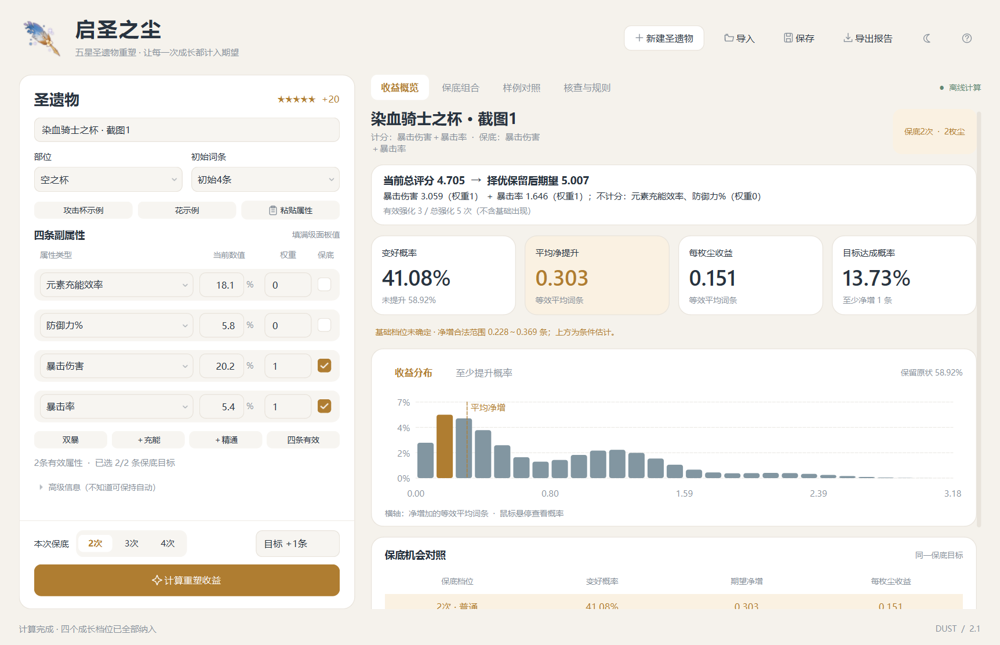
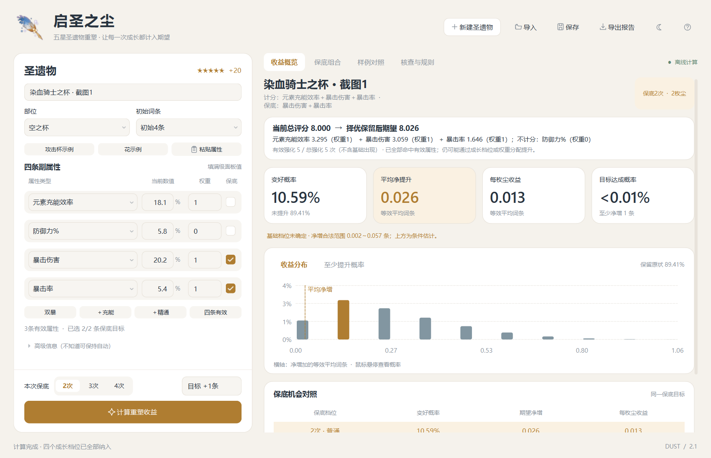
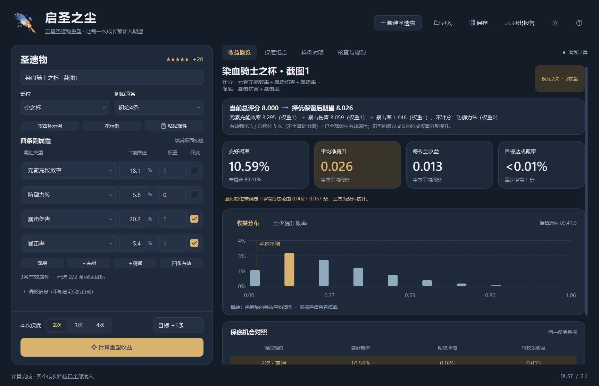

# 启圣之尘收益计算器

[](https://github.com/winepaper/genshin-dust-calculator/actions/workflows/ci.yml)
[](https://github.com/winepaper/genshin-dust-calculator/releases/latest)


计算《原神》五星 +20 圣遗物使用启圣之尘后的评分分布、提升概率和每枚尘收益。
支持四档成长数值、任意副属性权重、两条保底目标、2／3／4次保底，以及未知基础档位的合法范围。

**[下载 Windows EXE](https://github.com/winepaper/genshin-dust-calculator/releases/latest)** · [使用说明](docs/USER_GUIDE.md) · [计算模型](docs/MODEL.md) · [独立验算](docs/VERIFICATION.md)

无需安装 Python，解压发行包后双击 EXE。已在 Windows 10 64位环境实际验证；源代码开发使用 Python 3.13。



## 先理解收益口径

界面的“平均净提升”指 **坏结果保留旧圣遗物后的期望**：

```text
评分 S = Σ 权重 × 副属性实际值 / 该属性一次成长均值
择优净提升 = E[max(新评分 - 旧评分, 0)]
```

所以正的期望收益可能同时伴随很高的失败率；保留旧结果仍消耗启圣之尘。
原始新结果的平均评分在报告中单独列出，可能低于旧评分。[充能权重100的风险说明](docs/verification/er-only-risk.md)给出完整例子。

**权重和保底目标相互独立。** 没勾选保底、但权重大于0的属性，仍参与全部评分和收益计算。
权重 `100:1:1` 表示一次平均充能成长的价值是一次平均暴击成长的100倍；完全只看充能时，把其他权重设为0。

## 换一件圣遗物怎么填

1. 点击“新建圣遗物”，选择部位和初始3／4词条；不知道初始词条数可自动推断。
2. 输入四条副属性类型及 +20 面板数值。百分比填 `6.6` 表示 `6.6%`，固定属性填整数。
3. 独立设置每条权重，支持1～4条有效属性；默认暴击率、暴伤各1，其余0。
4. 勾选两条游戏保底目标，选择本次保底2／3／4次，再点击计算。
5. 已知强化次数、基础档位或定义目标时，在高级设置中补充；强化次数不包含基础出现一次。

支持粘贴四条副属性文字、JSON导入/保存、六种保底组合排名、HTML和完整离散分布CSV导出。
界面顶部直接显示各条计分贡献和有效强化次数；修改输入后旧结果会标记为待重算。



## 示例配置

导入以下配置可直接复核：

| 文件 | 用途 |
|---|---|
| [cup-crit.json](examples/cup-crit.json) | 攻击杯，默认双暴权重 |
| [flower-crit.json](examples/flower-crit.json) | 生之花，默认双暴权重 |
| [cup-three-effective.json](examples/cup-three-effective.json) | 充能和双暴各1，五次强化全有效 |
| [cup-er100.json](examples/cup-er100.json) | 充能100、双暴各1，仍保底双暴 |

最后一种配置在保底2次时的提升概率约10.11%，择优期望净增5.408**加权分**。
若每次都接受新结果，平均评分却从334.223降至228.463；这两个期望不能混淆。

## 源码运行

在项目根目录执行：

```powershell
py -3.13 -m venv .venv
.\.venv\Scripts\python.exe -m pip install -r requirements.txt
.\.venv\Scripts\python.exe app.py
```

浅色／深色主题可在右上角切换。所有计算均在本地进行；程序不需要原神账号或联网。



## 测试与独立计算

计算内核及文本解析仅依赖 Python 标准库：

```powershell
python -m unittest discover -s tests -p "test*.py" -v
python verify.py
```

安装界面依赖后可执行 Qt交互检查：

```powershell
.\.venv\Scripts\python.exe tests/gui_check.py
```

15项模型／解析测试和Qt界面检查已在本地通过。独立算术脚本不调用生产内核的推断或保底动态规划，覆盖两个原始截图、三条有效属性、充能权重100及只看充能的风险。
截图和临时核验输出写入被Git忽略的 `artifacts/`。

## 打包 Windows EXE

```powershell
.\.venv\Scripts\python.exe -m pip install -r requirements-dev.txt
.\build.ps1 -Python .\.venv\Scripts\python.exe
```

输出为 `dist/GenshinDustCalculator.exe`。
`calculator.spec` 隔离其他应用的DLL搜索路径，打包Qt配套VC运行库，使用Windows自带的UCRT，避免曾出现的QtCore DLL加载失败。
GitHub Actions提供测试和Windows构建；推送 `v*` 标签时自动构建发行包。详见[开发与发布](docs/DEVELOPMENT.md)。

## 模型边界

- 采用社区“末尾补足保底”模型，保留基础值，重新抽取强化落点和四档成长。
- 官方公开的保证次数并不能唯一确定完整随机算法；模型内精确枚举不等于直接验证了服务器随机实现。
- 未知基础档位使用原始随机强化、四档等概率的条件先验；历史择优重塑和人为筛选可能影响先验。
- 合法范围是输入信息不足造成的范围，不是置信区间；两位小数成长表不能完全重现游戏内部浮点舍入。
- 加权副属性评分不等于角色伤害增幅。未加入暴击溢出、充能阈值或队伍伤害公式。
- 本次保底档位由用户选择，不自动跟踪账户保底进度；定义圣遗物只能使用其固定目标。

## 项目结构

```text
app.py / qt_app.py       Windows桌面界面与入口
engine.py / common.py   离散计算、输入解析和报告
tests/                  模型、文本与Qt交互检查
verification/           独立算术实现
examples/               可导入配置
docs/                   使用、模型、核验和开发文档
assets/                 图标和小型控件图形
.github/workflows/      测试与Windows发行构建
```

## 许可证与素材

本项目原创代码使用 [MIT许可证](LICENSE)。原神道具素材、Qt等第三方内容**不由MIT许可证授权**；来源与许可证见 [THIRD_PARTY_NOTICES.md](THIRD_PARTY_NOTICES.md) 和 [assets/SOURCES.md](assets/SOURCES.md)。
这是社区工具，与HoYoverse／米哈游无官方关联。

### English overview

A local Windows calculator for Genshin Impact artifact reshaping with Dust of Enlightenment.
It enumerates discrete upgrade outcomes, supports arbitrary substat weights, and separates scoring stats from the two guarantee targets.
Expected improvement uses keep-or-revert selection. The RNG is a documented community model, not a claim of verified official server probabilities.
